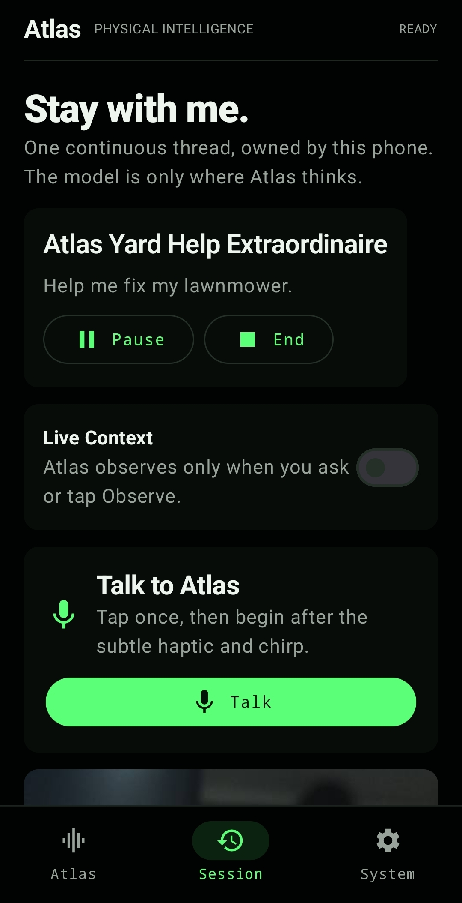
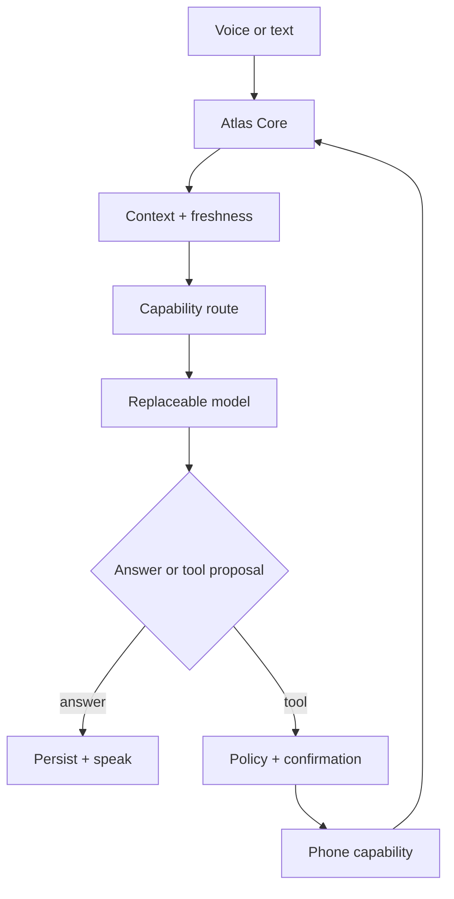

<p align="center">
  <strong>ATLAS</strong><br>
  <sub>PHYSICAL INTELLIGENCE</sub>
</p>

<h1 align="center">The Model Is Not the Agent.</h1>

<p align="center">
  Android-native physical agent runtime by Seth Esquieu.<br>
  <strong>The phone is the body. Models are replaceable reasoning engines.</strong>
</p>

<p align="center">
  <a href="#run-atlas">Run Atlas</a> ·
  <a href="./docs/architecture.md">Architecture</a> ·
  <a href="./docs/runtime-code-map.md">Runtime Code Map</a> ·
  <a href="./docs/README.md">Engineering Docs</a> ·
  <a href="./ROADMAP.md">Roadmap</a>
</p>

<p align="center">
  
</p>

<p align="center"><em>Current pre-v0.1 Android alpha. This is the real app, not a product mockup.</em></p>

---

Atlas is an Android-native runtime for a persistent physical agent. Changing from an on-device model to a LAN server or cloud API changes a capability, not the identity that owns the session.

Atlas is therefore not a chatbot shell and not a model-provider picker. It is the deterministic machinery around inference: the part that decides what evidence is current, what the user actually heard, what a tool is allowed to do, whether an interrupted action has an unknown outcome, and what must survive a process restart.

Atlas Core owns session state, device bindings, observations, freshness and confidence, heartbeat behavior, memory admission, speech, tool execution and policy, budgets, events, replay, and lifecycle. Inference remains downstream intelligence that can run on-device, across a LAN, or through a user-configured cloud provider.

> **Status:** public pre-v0.1 open-source alpha. Atlas is appropriate for development and invited physical-device testing, not unattended, emergency, safety-critical, or production operation.

## Start here

| If you want to... | Go here |
| --- | --- |
| Build and run the Android app | [`apps/atlas-android`](./apps/atlas-android) |
| Understand the system at a glance | [`docs/architecture.md`](./docs/architecture.md) |
| Trace a turn through the shipping runtime | [`docs/runtime-code-map.md`](./docs/runtime-code-map.md) |
| Understand the Android runtime in detail | [`docs/android-runtime-architecture.md`](./docs/android-runtime-architecture.md) |
| Dig into context, memory, and sidecars | [`docs/context-memory-and-sidecars.md`](./docs/context-memory-and-sidecars.md) |
| Understand failures and execution semantics | [`docs/failure-semantics.md`](./docs/failure-semantics.md) |
| Browse all engineering documentation | [`docs/README.md`](./docs/README.md) |
| See what is intentionally unfinished | [`ROADMAP.md`](./ROADMAP.md) |

## Why Atlas exists

Most agent frameworks begin with a model conversation and attach tools. Atlas begins with a continuing physical session:

- What device and environment is this agent bound to?
- What did it actually observe, when, and with what confidence?
- Is that context still fresh and suitable for the current question?
- What did the user hear before interrupting?
- Which memory is valid for this session, task, person, or workspace?
- Which physical or external actions are permitted?
- What happened across failure, restart, and provider replacement?

The model can reason about these questions. It does not get to define their answers.

## One turn, end to end



The native implementation starts at [`AtlasMobileRuntime.startUserTurnLocked`](./apps/atlas-android/app/src/main/java/com/grinningfrog/atlas/runtime/AtlasMobileRuntime.kt), projects Core-owned state through [`ContextAssembler`](./apps/atlas-android/app/src/main/java/com/grinningfrog/atlas/runtime/ContextAssembler.kt), chooses endpoints with [`CapabilityRouter`](./apps/atlas-android/app/src/main/java/com/grinningfrog/atlas/provider/CapabilityRouter.kt), and persists lifecycle evidence through [`AtlasDatabase`](./apps/atlas-android/app/src/main/java/com/grinningfrog/atlas/data/AtlasDatabase.kt).

The [runtime code map](./docs/runtime-code-map.md) traces the complete path and distinguishes the shipping Kotlin runtime from the provider-independent TypeScript reference Core.

## What is real today

The native Android reference app currently provides:

- a foreground, device-owned persistent session service;
- durable SQLite sessions, turns, messages, observations, memory, tool calls, speech delivery, and ordered events;
- CameraX capture with rotation, resize, recompression, hashing, and per-purpose byte budgets;
- motion-aware visual freshness and detail-suitability checks;
- push-to-talk, streaming sentence-aware TTS, and barge-in tracking;
- manual and Live Context modes with scene-change and proactive-inference limits;
- bounded multi-step model/tool turns with confirmation and restart recovery;
- durable conversational clarification that survives tangents and blocks ambiguous physical actions;
- capability routes for `fast`, `vision`, `reasoning`, and `fallback`;
- direct OpenAI-compatible local, LAN, and cloud endpoints;
- optional Atlas Managed account/inference plumbing; and
- in-app session, inference, health, context, and event views.

The TypeScript packages contain the provider-independent Core model, deterministic freshness/heartbeat logic, event materialization, scoped memory, runtime-policy resolution, task-run lifecycle, replay, CLI, and scenario harnesses. OpenClaw components remain only as documented legacy proof adapters.

## Design principles

Atlas is opinionated about where intelligence belongs:

- **The runtime owns identity.** A provider swap should not turn Atlas into a different agent.
- **Physical evidence has freshness.** A stronger model cannot reason its way out of stale observations.
- **Execution state matters.** Success, failure, timeout, interruption, and unknown outcome are not interchangeable.
- **Deterministic machinery should stay deterministic.** Models are used where probabilistic intelligence adds value, not simply because a model is available.
- **Capability and reliability are different variables.** An endpoint can know how to do something and still be unreliable at invoking that capability when it matters.

For the deeper rationale, start with the [engineering documentation index](./docs/README.md).

## Open platform and commercial services

Atlas uses an open-platform model:

- **Atlas Open Platform:** Apache-2.0 Core, Android reference app, SDK contracts, tests, and BYOI.
- **Atlas Managed Inference:** optional paid operated inference, routing, metering, and support.
- **Atlas Enterprise:** future commercial organization, fleet, procedure, policy, integration, audit, and operational control plane built on the same Core.

Open Atlas does not require an Atlas account. Managed inference does not own the physical session. Enterprise must extend versioned open contracts rather than fork a private runtime.

Read [`docs/product-structure.md`](./docs/product-structure.md) for the exact boundary and [`docs/pricing-and-metering.md`](./docs/pricing-and-metering.md) for the alpha budget and later pricing framework.

## Run Atlas

Open [`apps/atlas-android`](./apps/atlas-android) in Android Studio, let Gradle sync, and run it on a physical Android device. Camera and microphone access are required for the complete loop.

Configure an OpenAI-compatible endpoint in the app. For LAN inference, use the computer's LAN address from the phone; `10.0.2.2` is only the Android emulator alias for its host.

See [`apps/atlas-android/README.md`](./apps/atlas-android/README.md) for setup, provider compatibility, media handling, speech behavior, and current limitations.

## Build and test Core

Node.js 22 or later is required.

```bash
npm ci
npm run build
npm run typecheck
npm test
npm run check:public
```

Managed inference is optional. See [`apps/atlas-cloud/README.md`](./apps/atlas-cloud/README.md) for its separate local setup.

## Repository map

| Path | Purpose |
| --- | --- |
| `apps/atlas-android` | Native Android reference app and primary v0.1 experience |
| `apps/atlas-cloud` | Optional reference managed-inference/auth/billing gateway |
| `packages/atlas-core` | Provider-independent runtime types, policy, events, replay, and tests |
| `packages/atlas-config` | Configuration contracts |
| `packages/atlas-cli` | Prototype session inspection and development commands |
| `packages/atlas-test-harness` | Scenario, replay, and adapter test utilities |
| `packages/atlas-device-android` | Legacy TypeScript Android bridge adapter |
| `packages/atlas-provider-openclaw` | Legacy OpenClaw proof adapter, not a product dependency |
| `docs` | Architecture, product boundaries, testing, policies, and release gates |

## v0.1 boundary

One Android phone, one durable personal workspace, one excellent observe-reason-act-respond loop, user-owned inference, and enough evidence to explain every consequential decision.

The source repository is public. [`OPEN_SOURCE_CHECKLIST.md`](./OPEN_SOURCE_CHECKLIST.md) records the release-readiness work and remaining repository hardening. Distribution of a signed closed-alpha APK is a separate gate tracked by [`docs/closed-alpha.md`](./docs/closed-alpha.md).

## Contributing and security

Contributions are welcome under the process in [`CONTRIBUTING.md`](./CONTRIBUTING.md) and require Developer Certificate of Origin sign-off. Report vulnerabilities privately according to [`SECURITY.md`](./SECURITY.md).

## License

Atlas repository code and documentation are licensed under the [Apache License 2.0](./LICENSE) unless a file states otherwise. Dependencies retain their own licenses. The software license does not grant rights to official project identity or imply access to Atlas-operated services.
