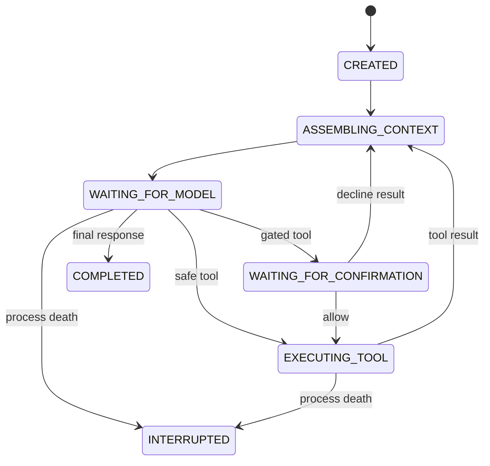

# Atlas durable agent runtime

Atlas does not treat a provider process, chat thread, or model response ID as the agent. The agent is a projection of Core-owned facts that can be reconstructed for any compatible inference provider.

## Runtime guarantees

The Android reference runtime provides these boundaries:

1. Every user interaction has a durable `turn_id` before inference begins.
2. User, assistant, and tool messages are persisted before later steps consume them.
3. Context is assembled deterministically from Core-owned state under explicit size limits.
4. Context truncation preserves whole turns, including assistant tool proposals and their tool results.
5. Providers may propose tools but cannot execute them.
6. Core validates registration, JSON size, per-tool limits, session permissions, and confirmation policy before execution.
7. Tool status is persisted before and after an effect. Completed calls are never executed again by the runtime.
8. Calls left running during process death become `UNKNOWN`; Atlas does not guess that they failed or retry them.
9. Provider failures with ambiguous outcomes stop routing, preventing an automatic second paid inference attempt.
10. Provider continuation identifiers are telemetry and cache hints only. Conversation authority stays in Atlas.

## Durable projections

SQLite is the device-local authority. The append-only event stream remains the audit ledger; these tables are queryable projections:

| Projection | Purpose |
| --- | --- |
| `turns` | Durable turn state machine, step count, terminal error |
| `messages` | Ordered user, assistant, and tool transcript |
| `tool_calls` | Proposal, policy, confirmation, execution, result, idempotency key |
| `memory_items` | Explicit working, task, environment, and durable memory |
| `session_summaries` | Replaceable checkpoint of compacted older dialogue |
| `observations` | Physical evidence and media metadata |

Projection writes also append audit events. A future event materializer can rebuild these tables without changing the provider contract.

## Turn state machine

Terminal states are `COMPLETED`, `FAILED`, `CANCELLED`, and `INTERRUPTED`. Waiting for user confirmation is intentionally restart-safe.

## Context construction

The provider packet is derived in this order:

1. Atlas authority, safety, and tool-use instructions
2. Session goal
3. Older conversation checkpoint
4. Atlas-admitted memory grouped by kind
5. Current physical observation metadata and prior interpretation
6. Recent complete conversation turns
7. Tool schemas supported by the selected endpoint
8. Current image bytes only when vision is needed or a capture tool just returned one

Current defaults are 32 messages, 32,000 conversation characters, and 8,000 memory characters. These are policy values, not provider assumptions.

After 28 uncompacted messages, Atlas asks the fast route for a loss-minimizing checkpoint while retaining four complete recent turns verbatim. A failed compaction never fails the user turn. Checkpoints are derived caches; messages and events remain authoritative.

## Memory policy

| Kind | Meaning | Admission |
| --- | --- | --- |
| `WORKING` | Constraints and facts needed during the active session | Core tool execution |
| `TASK` | Progress, decisions, completed and pending steps | Core tool execution |
| `ENVIRONMENT` | Physical facts with observation provenance and a bounded TTL (five minutes by default) | Core tool execution |
| `DURABLE` | User preference or fact available to later local sessions | Explicit user confirmation |

Models receive memory IDs and can propose updates through `atlas_remember`. They cannot write the database directly. Users can inspect and forget admitted memory in the app.

The current alpha stores memory locally. Working, task, and environment memory remain session-scoped; approved durable memory is device-wide so a later local session can use it. Environment memory records an observation ID and expires instead of silently becoming timeless world truth. Account-scoped encrypted sync, multi-user isolation, conflict resolution, and multi-device memory are separate future capabilities; inference providers must not become the synchronization layer.

## Tool contract

`AtlasToolAdapter` is the stable device/runtime extension point. Each adapter owns:

- A provider-neutral JSON schema
- A risk class
- A per-turn call limit
- A policy decision
- An executor returning a JSON result

Built-in tools are `capture_current_view`, `get_device_state`, and `atlas_remember`.

Adding location, notifications, Bluetooth, smart-home, or account tools requires an adapter, not a change to the agent loop. External-effect adapters default to confirmation when the session policy requires it.

The loop permits at most eight model steps, twelve total tool calls, and three minutes of wall time. These limits prevent accidental infinite inference/tool cycles.

## Provider portability

The Android backend uses the OpenAI-compatible messages and function-tools shape because it is broadly implementable by local, LAN, and cloud servers. Atlas Cloud forwards the same contract to its selected frontier model. An endpoint must explicitly advertise tool support before Core sends schemas to it.

Providers that do not support tools still receive durable multi-turn dialogue and physical context. They cannot be selected for tool-capable steps. Model names remain endpoint configuration, never Core policy.

## Failure semantics

- Connect and DNS failures may proceed to a declared fallback route.
- Timeouts, malformed successful responses, and most post-dispatch failures are ambiguous and do not fall through automatically.
- Cancelling a turn cancels the in-flight HTTP call and persists `CANCELLED`.
- Process restart marks in-flight model turns `INTERRUPTED`.
- Process restart marks running tool calls `UNKNOWN` and never reruns them.
- Process restart rejects proposed/approved calls that had not entered `RUNNING`; these are known not to have executed.
- User-confirmation waits survive restart.

Future externally visible tools should add adapter-specific reconciliation for `UNKNOWN` outcomes.

## Scale boundary

The physical loop is deliberately device-owned. Millions of devices therefore do not require one central scheduler to own millions of live sessions. Cloud infrastructure can remain stateless for inference routing and metering while each device owns its active state.

Before cross-device sync, events need an authenticated owner/device envelope, encrypted payload policy, retention controls, conflict rules, and server-side sequence assignment. None of those concerns belong in inference adapters.
