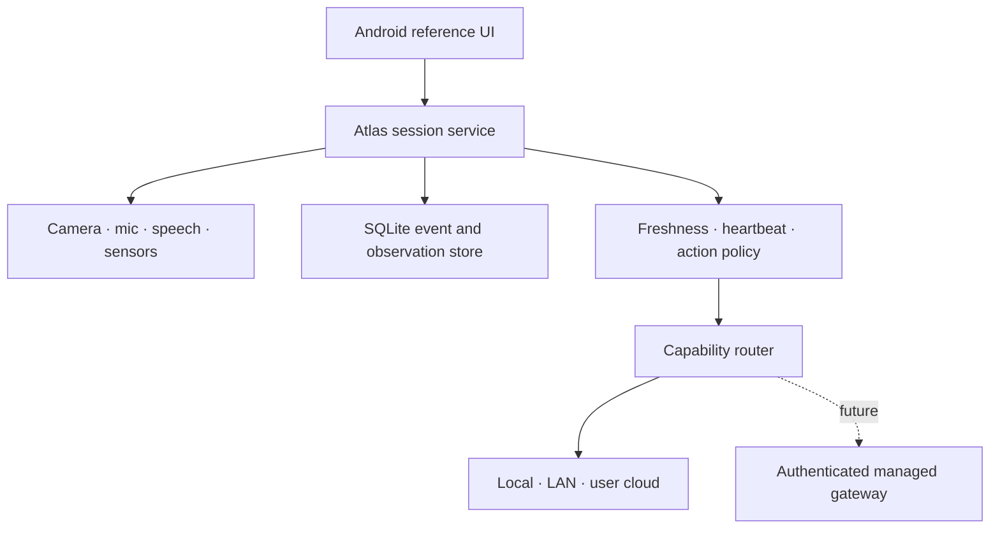

# Android runtime architecture and v0.1 boundary

## Decision

Atlas v0.1 is an Android-first, device-owned physical-agent runtime with bring-your-own inference. The phone is not an OpenClaw node and no upstream provider owns the physical session.

Native Kotlin is deliberate for the POC: foreground-service rules, CameraX lifecycle, speech APIs, sensor sampling, Android Keystore, and thermal/battery state are central product behavior. A later iOS app should implement the same contracts and event semantics; forcing shared UI or device code before those contracts stabilize would make the runtime harder to reason about.

The solid arrows exist in the POC. The managed gateway does not.

## Ownership boundary

| Concern | Atlas Core | Inference endpoint |
| --- | --- | --- |
| Session ID, lifecycle, goal | Owns | Receives scoped prompt context |
| Device permissions | Owns and enforces | Cannot grant or bypass |
| Observation media and timestamps | Captures and stores | Receives selected sample |
| Context freshness | Computes before inference | Must respect supplied age |
| Heartbeat schedule | Owns | Reviews selected changes only |
| Tool execution | Authorizes, executes, records | May eventually propose calls |
| Speech and interruption | Owns | Produces candidate response text |
| Provider failover | Owns capability route | Is one replaceable endpoint |
| Audit and replay | Owns ordered event stream | Correlates through request ID |
| Billing and entitlements | Future app/control-plane seam | Never represented by a shared secret in the app |

## Runtime lifecycle

The foreground `AtlasSessionService` is the process-local composition root. It owns controllers and `AtlasMobileRuntime`; the Compose Activity binds and renders state but can disappear without ending the session.

Session mutations are serialized. Pausing or ending increments a generation token and cancels heartbeat work. A provider result that returns after the generation changes is recorded and discarded instead of speaking into the wrong lifecycle state.

The local event table uses an auto-incrementing sequence. Wall-clock timestamps remain evidence, but are never used as the ordering cursor. This avoids ambiguous ordering when multiple events occur in the same millisecond.

## Physical loop

1. User input is classified by whether it requires present visual context.
2. Atlas evaluates observation age, motion, stability, risk, and expected refresh latency.
3. Atlas captures when a current claim requires it; high-risk questions fail closed if refresh fails.
4. Atlas selects a capability (`vision` or `reasoning`) and invokes configured endpoints in order.
5. Atlas records request, route attempts, latency, result or failure, and lifecycle disposition.
6. Atlas preserves a textual answer even if speech synthesis fails; speech can be interrupted locally.
7. Heartbeat independently adapts observation cadence to motion, battery, and thermal pressure. Deterministic scene difference gates model review and unsolicited speech defaults off.

## Commercial seam without premature SaaS

Direct BYOI is the default and does not require an Atlas account. A managed plan can later be represented as a provider endpoint whose credential is a short-lived user token, not the operator's model API key. The server side would need authentication, entitlement checks, quotas, per-request metering, provider-key custody, abuse controls, and cost observability.

That system is intentionally absent until the device loop is good enough to justify selling. The client-side boundary exists now so introducing it later does not require changing session semantics.

## Legitimate v0.1 boundary

The v0.1 claim should be narrow: another Android developer can install Atlas, connect their own inference endpoint, run a persistent observe–reason–respond session, inspect why the runtime refreshed or reused context, and recover cleanly from ordinary provider/device failures.

Must-have before tagging v0.1:

- reproducible Gradle wrapper and Android CI build/test;
- physical-device validation across a small supported-device matrix;
- explicit per-capability route editor and connection test;
- streaming response cancellation and strict request-size limits;
- session permission editor plus retention, delete, and export controls;
- structured tool proposal/authorization/execution boundary with one safe reference tool;
- database migrations, crash recovery tests, and deterministic replay fixture;
- network security configuration, privacy copy, and secret-handling review;
- onboarding, troubleshooting, signed artifacts, and one end-to-end sample endpoint guide;
- measured capture-to-answer and speech-turn latency budgets.

Experiments to keep out of v0.1:

- Modulo integration or co-development;
- autonomous background sessions without prominent user control;
- multi-device session handoff;
- generalized memory/sidecar systems;
- provider marketplaces or model benchmarking;
- Atlas-hosted frontier inference and subscription infrastructure;
- premature shared cross-platform UI architecture.

The next milestone is not more adapters. It is making this one loop dependable, legible, safe, and pleasant on a phone.
