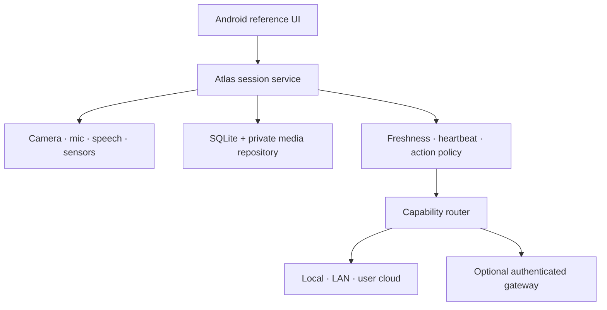

# Android runtime architecture and v0.1 boundary

## Decision

Atlas v0.1 is an Android-first, device-owned physical-agent runtime with bring-your-own inference. The phone is not an OpenClaw node and no upstream provider owns the physical session.

Native Kotlin is deliberate for the POC: foreground-service rules, CameraX lifecycle, speech APIs, sensor sampling, Android Keystore, and thermal/battery state are central product behavior. A later iOS app should implement the same contracts and event semantics; forcing shared UI or device code before those contracts stabilize would make the runtime harder to reason about.

All solid arrows now have repository implementations. The managed gateway is optional deployment plumbing, not a hosted production service in this repository.

## Ownership boundary

| Concern | Atlas Core | Inference endpoint |
| --- | --- | --- |
| Session ID, lifecycle, goal | Owns | Receives scoped prompt context |
| Device permissions | Owns and enforces | Cannot grant or bypass |
| Observation media and timestamps | Normalizes, budgets, hashes, stores, and selects | Receives bytes for one selected sample; never a device path |
| Context freshness | Computes before inference | Must respect supplied age |
| Heartbeat schedule | Owns | Reviews selected changes only |
| Tool execution | Validates, authorizes, executes, records, and returns results | Proposes typed calls only |
| Speech and interruption | Owns | Produces candidate response text |
| Provider failover | Owns capability route | Is one replaceable endpoint |
| Audit and replay | Owns ordered event stream | Correlates through request ID |
| Billing and entitlements | Optional account adapter; never session authority | Gateway meters user credits; provider secret stays server-side |

## Runtime lifecycle

The foreground `AtlasSessionService` is the process-local composition root. It owns controllers and `AtlasMobileRuntime`; the Compose Activity binds and renders state but can disappear without ending the session.

Session mutations are serialized. Pausing or ending increments a generation token and cancels heartbeat work. A provider result that returns after the generation changes is recorded and discarded instead of speaking into the wrong lifecycle state.

The local event table uses an auto-incrementing sequence. Wall-clock timestamps remain evidence, but are never used as the ordering cursor. This avoids ambiguous ordering when multiple events occur in the same millisecond.

## Physical loop

1. User input is classified by whether it requires present visual context.
2. Atlas evaluates observation age, motion, stability, risk, and expected refresh latency.
3. Atlas captures when a current claim requires it; high-risk questions fail closed if refresh fails.
4. Atlas reconstructs bounded multi-turn context from messages, admitted memory, a rolling checkpoint, and current physical state.
5. Atlas selects a capability (`fast`, `vision`, or `reasoning`) and invokes a compatible endpoint.
6. A provider may return a final answer or propose tools. Core validates, gates, executes, persists, and returns tool results until the turn completes or reaches a hard budget.
7. Atlas records request, route attempts, latency, result or failure, and lifecycle disposition.
8. Atlas preserves a textual answer even if speech synthesis fails; speech and an active inference turn can be interrupted locally.
9. Live Context, when explicitly enabled, adapts observation cadence to motion, battery, and thermal pressure. Deterministic scene difference gates model review, a durable rolling window limits proactive inference, and unsolicited speech defaults off.

New sessions use manual context mode. Manual mode performs no background capture or inference but retains explicit asks, voice requests, and Observe. Live mode is persisted with the session and visible in both the UI and foreground notification. Pausing or ending cancels its heartbeat immediately.

Successful heartbeat interpretation is attached to the exact source observation with its interpretation timestamp. Later requests may reuse both the bounded image and this semantic context while freshness policy still considers them valid. Media suitability is independent of time freshness: detail requests cannot reuse heartbeat-sized images.

## Media boundary

Camera output first lands in a temporary cache file. Core then performs sampled decode, EXIF correction, proportional resizing, iterative JPEG compression, and further downscaling until the artifact meets its purpose-specific pixel and byte budget. Only that normalized artifact is committed to app-private storage. Observation persistence uses an opaque storage key plus integrity and performance metadata; providers receive an in-memory image value.

This makes image cost and upload latency bounded inputs to policy rather than accidental properties of a phone camera. Heartbeats use the smallest budget, normal questions use a middle budget, and high-risk/detail refreshes may use the largest budget.

## Optional commercial seam

Direct BYOI is the default and does not require an Atlas account. The optional `apps/atlas-cloud` adapter uses a short-lived Supabase user token, never the operator's model key. It provides capability routing, reserve/settle credit metering, a subscription allowance, and one-time credit blocks. Stripe grants and inference charges are idempotent ledger entries.

The gateway owns identity, entitlement, metering, and provider-key custody only. It receives no durable Atlas session and cannot schedule a heartbeat, operate a device, or execute a tool. Public operation still requires rate limiting, abuse controls, reconciliation, alerts, legal/payment policy, and a deliberate pricing configuration.

## Legitimate v0.1 boundary

The v0.1 claim should be narrow: another Android developer can install Atlas, connect their own inference endpoint, run a persistent observe–reason–respond session, inspect why the runtime refreshed or reused context, and recover cleanly from ordinary provider/device failures.

Must-have before tagging v0.1:

- reproducible Gradle wrapper and Android CI build/test;
- physical-device validation across a small supported-device matrix;
- explicit per-capability route editor and connection test;
- streaming response cancellation and strict request-size limits;
- session permission editor plus retention, delete, and export controls;
- physical-device validation of the durable tool/confirmation/restart loop;
- database migrations, crash recovery tests, and deterministic replay fixture;
- network security configuration, privacy copy, and secret-handling review;
- onboarding, troubleshooting, signed artifacts, and one end-to-end sample endpoint guide;
- measured capture-to-answer and speech-turn latency budgets.

Experiments to keep out of v0.1:

- Modulo integration or co-development;
- autonomous background sessions without prominent user control;
- multi-device session handoff;
- embedding/vector retrieval and cross-device memory sync;
- provider marketplaces or model benchmarking;
- additional managed inference providers, tiers, or a generalized model marketplace;
- premature shared cross-platform UI architecture.

The next milestone is not more adapters. It is making this one loop dependable, legible, safe, and pleasant on a phone.
