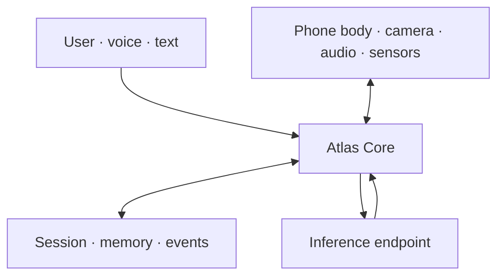

# Atlas Architecture

Atlas is organized around a stable Core with replaceable inference and device capabilities. In the native app, the phone-side runtime is Core; a model endpoint is downstream reasoning, not an upstream agent owner.

Core owns the physical session loop. Adapters translate protocols and capabilities. See [`runtime-code-map.md`](./runtime-code-map.md) for the shipping Kotlin/runtime-reference TypeScript boundary.

See also [`context-memory-and-sidecars.md`](./context-memory-and-sidecars.md) for the longer-term architecture around context lanes, weighted belief memory, spillover quarantine, provider sidebands, and budgeted inference sidecars.

See [`enterprise-boundaries.md`](./enterprise-boundaries.md) for the consumer-to-organization ownership model, task runs, scoped memory, policy inheritance, event identity, and tenant isolation.

## Core Responsibilities

- session lifecycle
- event intake
- heartbeat/perception loop
- user interaction loop
- materialized state
- context freshness and confidence
- tool arbitration/execution
- audit logging
- workspace and task ownership
- scoped memory visibility
- resolved runtime policy

## Context Lanes

Atlas Core should keep three context lanes distinct:

- **Physical context:** device/perception-derived claims about the active physical reality.
- **Supporting context:** task-relevant artifacts such as floorplans, manuals, maps, docs, OCR results, and procedures.
- **Spillover:** unrelated assistant requests such as reminders, emails, calendar work, or side conversations.

Core invariant: spillover must not pollute physical session memory. Only context explicitly admitted through Atlas policy may enter physical session state.

## Adapter Responsibilities

- Device adapters expose normalized physical capabilities.
- Provider adapters map normalized Atlas turns to runtime-native calls.

Adapters should not own session continuity or long-term policy.

Provider adapters may eventually return structured sideband suggestions such as artifacts, route hints, belief candidates, and tool calls. These are advisory. Providers suggest meaning; Atlas owns physical truth.
