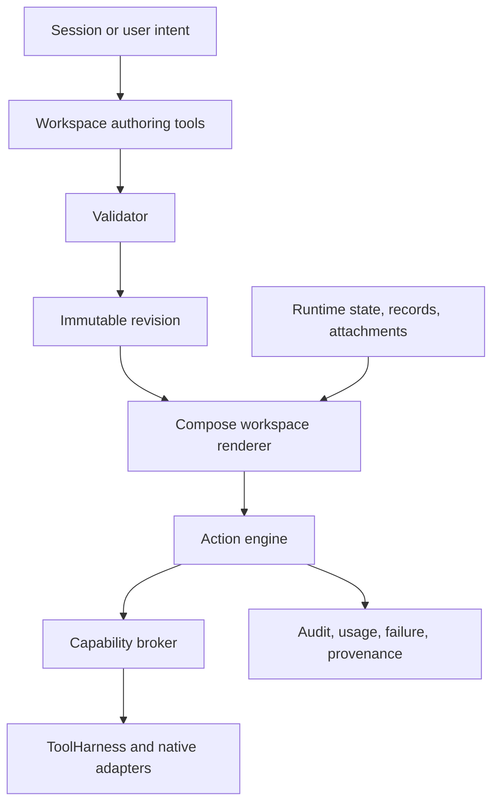

# Composable Workspaces

Status: proposed architecture and implementation specification, October 2026. Nothing in this document should be described as shipping until the corresponding acceptance gates pass on a real Android device.

## 1. Objective

Atlas should allow a user and an Atlas session to create, operate, revise, test, and preserve small purpose-built applications without modifying Kotlin, rebuilding the APK, or weakening Atlas Core's authority boundary.

The installed Android application remains the protected kernel. It owns identity, provider routing, permissions, credentials, tools, storage enforcement, audit, recovery, and native device adapters. A **workspace** is a persistent, declarative artifact interpreted by that kernel. A **session** is a bounded period during which the Atlas harness is active and can reason about, operate, or propose changes to a workspace.

The product-level contract is:

> A session is the start/stop boundary of the Atlas harness loop. A workspace is the persistent active environment where work is performed and artifacts live.

Ending a session stops live agent behavior. It does not close, erase, or invalidate the active workspace.

## 2. Motivating experiences

The architecture must support all of these without adding purpose-specific Android screens:

1. A user asks Atlas to create a photo collection that captures images on request, records ambient lux and calculated image luminance, categorizes images, and sorts or filters the gallery.
2. The user later asks to create a doodle pad with brush, color, undo, save, and PNG export.
3. A user with an installed Bluetooth adapter asks Atlas to assemble a temporary diagnostic UI from already-authorized scan, connection, read, write, notification, table, chart, and capture primitives.
4. A user opens an existing fixture workspace, talks to Atlas from within it, and asks for the visible workflow to be simplified.
5. The user ends the conversational session while the workspace remains usable as a deterministic application.
6. The user explicitly authorizes Atlas to iterate on a draft revision overnight using validation, replay data, simulations, and bounded inference, then reviews the candidate the next morning.

BLE, photography, drawing, and fixture testing are examples. Atlas must not encode any of them as the workspace abstraction itself.

## 3. Goals

- Make Workspace a first-class, navigable Android destination.
- Preserve a seamless PTT and text interaction path in both Session and Workspace.
- Give Atlas fresh, explicit knowledge of the workspace, view, and object the user is currently using.
- Persist workspace definitions, structured records, attachments, revisions, permissions, and provenance across sessions.
- Render useful native interfaces from validated declarative definitions.
- Run ordinary workspace behavior deterministically without requiring inference.
- Let sessions create and patch workspaces through narrow Core-owned tools.
- Make every change atomic, versioned, inspectable, reversible, and attributable.
- Extend persistent intent into bounded workspace work runs without mixing it into interactive inference.
- Keep existing session, local inference, LAN, BYOK, ChatGPT-plan, managed, camera, speech, tool, and idle-runtime behavior working when workspaces are unused.
- Produce a live-testable vertical slice, not a schema-only foundation.

## 4. Non-goals for the first implementation

- Downloading or executing arbitrary Kotlin, Java, Python, JavaScript, native binaries, or APK fragments.
- Self-modifying Atlas Core or dynamically adding Android permissions.
- Exposing Android `Context`, reflection, raw credentials, or unrestricted files/networking to generated definitions.
- A third-party marketplace.
- Cloud synchronization or multi-device collaborative editing.
- Real-time multi-user editing.
- Arbitrary HTML/WebView applications.
- Fully free-form layout or pixel-perfect design generation.
- Workspace-to-workspace executable calls.
- Unattended physical experimentation by default.
- Automatic promotion of generated drafts to live workspaces unless a later policy explicitly permits it.

## 5. Terminology and the existing name collision

The current database and model use `Workspace` for the personal or organizational ownership boundary that scopes sessions, policies, events, tasks, and memory. The composable artifact described here is a different object: one ownership boundary can contain many user-facing workspaces.

The architecture therefore adopts these conceptual names:

| Term | Meaning |
| --- | --- |
| **Realm** | Personal or organizational authority and ownership boundary. This is the concept currently represented by `AtlasWorkspace` and the `workspaces` table. |
| **Workspace** | A persistent composable artifact containing definition, data, views, actions, permissions, and revisions. |
| **Session** | A bounded live Atlas harness loop with transcript, observations, current turns, and session-scoped memory. |
| **Task run** | Durable progress toward a goal within a Realm and optionally a Workspace. |
| **Work run** | A bounded background attempt to inspect or revise a Workspace, normally on a draft branch. |
| **Workspace revision** | An immutable validated definition snapshot. |

To reduce migration risk, the initial implementation may retain the existing `workspaces` table name internally while treating it as a Realm in new domain APIs. New tables use unambiguous names such as `composable_workspaces`. A later dedicated migration may rename the legacy table and Kotlin type after all call sites are converted.

The Android UI uses **Workspace** only for composable artifacts. The Realm is normally invisible to a personal user.

## 6. Architectural invariants

1. **The model is not the runtime.** A provider may propose a workspace patch or action. Core validates, authorizes, applies, and audits it.
2. **The APK is the kernel.** Only a signed Atlas update may add native adapters, Android permissions, privileged storage paths, or new host capabilities.
3. **Definitions are data.** A workspace is interpreted declarative state, never downloaded executable application code.
4. **Deterministic behavior does not require inference.** Rendering, filtering, sorting, drawing, validation, data binding, and ordinary actions run locally.
5. **Authority is capability-based.** A workspace can request only registered host capabilities and never receives their backing Android objects.
6. **Displayed context is explicit.** Core, not the model, records which workspace, view, and object the user is viewing.
7. **User data is not definition state.** Definition rollback must not silently roll back or erase records and attachments.
8. **Generated changes are reversible.** Each accepted definition change creates an immutable revision and preserves a last-known-good revision.
9. **Background work is branched.** Idle iteration modifies a draft candidate, not the live revision.
10. **No-workspace behavior remains valid.** A session may run without an attached workspace exactly as Atlas does now.

## 7. Product navigation and interaction

### 7.1 Top-level destinations

The primary navigation becomes:

| Destination | Responsibility |
| --- | --- |
| **Session** | Full transcript, current observations, agent/tool activity, clarifications, session memory, lifecycle, and diagnostics. |
| **Workspace** | Workspace library or the active workspace's generated interface. |
| **System** | Inference, tools, permissions, intents/work runs, retention, export, health, and raw events. |

This supersedes the current interface document's three-way `Atlas / Session / System` presentation. Existing Atlas live-state material should be incorporated into Session without removing lifecycle, observation, voice, or evidence surfaces.

### 7.2 Shared interaction composer

Session and Workspace both display the same anchored interaction composer immediately above bottom navigation:

- text entry;
- PTT;
- current listening/processing/speaking state;
- optional attachment or Observe affordance when applicable;
- compact active-session indicator.

It is one composer backed by one current session, not two chat systems. A request submitted inside Workspace is appended to the normal session transcript and carries an authoritative workspace-context envelope.

When no session is active:

- deterministic workspace controls remain usable;
- the composer clearly indicates that Atlas is stopped;
- submitting text or pressing PTT offers or performs the configured start-session behavior with the displayed workspace attached;
- no passive listening is implied.

### 7.3 Session destination

Session owns the complete conversational history. It shows:

- user and assistant messages;
- tool proposals, confirmations, results, and failures;
- late responses and ambiguity;
- observations and freshness;
- active workspace identity and a switcher/link;
- session start, pause, end, export, and delete controls.

### 7.4 Workspace library

The Workspace root lists:

- recent workspaces;
- all workspaces;
- scratch workspaces;
- archived workspaces;
- candidate revisions awaiting review;
- create and import actions.

Each item exposes Open, Rename, Duplicate, Export, Archive, Permissions, Revision history, and Delete. Archive is the ordinary reversible removal action. Delete requires explicit confirmation and distinguishes definition deletion from deletion of records and attachments.

### 7.5 Active workspace

Tapping a workspace atomically:

1. opens its default or last-used view;
2. marks it as the displayed workspace;
3. attaches it as the active workspace of the current session, if any;
4. emits a durable `workspace.activated` event with prior and new identifiers;
5. makes the new context available to the next inference turn.

The active workspace view gives most of the screen to its generated UI. It does not duplicate the full transcript. Above the shared composer, it may show a compact, expandable agent surface for:

- current activity;
- latest short response;
- a clarification;
- confirmation or permission request;
- patch preview;
- error or stale-result notice;
- a link to the corresponding Session turn.

### 7.6 Displayed, active, selected, and focused state

Core tracks these separately even though ordinary navigation keeps them synchronized:

- `displayedWorkspaceId`: what the UI is rendering;
- `activeWorkspaceId`: what the current session is authorized to treat as active context;
- `activeRevisionId`: definition currently in use;
- `focusedViewId`: currently visible generated view;
- `selectedObject`: selected record, attachment, canvas object, or other addressable item;
- `navigationSequence`: monotonic context-change counter.

This prevents a late response intended for workspace A from mutating workspace B after the user navigates.

## 8. Session, workspace, and memory semantics

### 8.1 Current behavior to correct

Today, ending a session stops devices and active work and marks the session `DONE`, but retains its transcript, summary, observations, memories, events, and tool history. Deleting the session removes that session-owned state and media.

The schema already supports `SESSION`, `TASK`, `PRINCIPAL`, `WORKSPACE`, and `ENVIRONMENT` memory scopes. However, the current `atlas_remember` implementation creates session-scoped records by default even for the `durable` memory kind. The record survives storage but is not normally visible to a new session. The implementation must make memory scope truthful before workspace continuity relies on it.

### 8.2 Carry-over policy

| State | Survives End | Admitted to another session |
| --- | --- | --- |
| Current turn and partial provider stream | No; marked cancelled/interrupted | No |
| Unexecuted tool proposal | No; rejected/cancelled | No |
| Running external effect | Outcome preserved as known/unknown | Never retried implicitly |
| Transcript | Archived | Only by explicit history lookup or bounded handoff |
| Session summary | Archived | Optional source for a handoff, not universal context |
| Session working memory | Archived | No |
| Task memory | Yes | When continuing that task |
| Principal/user memory | Yes | When consent and current relevance allow |
| Workspace memory and records | Yes | When that workspace is active |
| Environment memory | Until stale/expired | When site/station and freshness still match |
| Workspace definition and artifacts | Yes | Yes |
| Capability grants | Yes according to grant policy | Re-evaluated against current Android permission and Core policy |

### 8.3 Session handoff

Ending a session attached to a workspace may generate or deterministically assemble a concise handoff containing:

- task or user objective;
- accepted workspace changes;
- current task status;
- unresolved questions;
- significant decisions;
- candidate next action;
- referenced record and revision identifiers.

The handoff is stored with provenance and bounded size. A later session receives the handoff plus current workspace state, not the full prior transcript.

### 8.4 Memory admission changes

`atlas_remember` must accept an explicit requested scope and Core must resolve its scope identifier. Defaults remain conservative:

- `working` -> Session;
- `task` -> current Task run, or Session when no task exists;
- `environment` -> current station/site with TTL and evidence;
- `durable` -> Principal only with confirmation;
- new `workspace` kind or explicit workspace scope -> active Workspace, with visible provenance and appropriate confirmation for sensitive content.

The model cannot supply arbitrary Realm, Principal, Task, or Workspace identifiers. It selects a symbolic scope; Core binds it to current authorized context.

## 9. Workspace domain model

A Workspace consists of separate durable concerns:

| Concern | Purpose |
| --- | --- |
| Identity | Stable ID, Realm owner, name, description, lifecycle status, timestamps. |
| Manifest | Format version, entry view, requested capabilities, quotas, compatibility. |
| Definition revision | Immutable validated views, schemas, actions, flows, and expressions. |
| Live pointer | Revision currently used by ordinary workspace operation. |
| Draft branch | Mutable candidate pointer and immutable candidate revisions. |
| Runtime state | Current view, small UI state, selected records, non-secret preferences. |
| Records | Typed user data belonging to named collections. |
| Attachments | App-private media and documents referenced by records. |
| Grants | User-approved capability scopes; never embedded secrets. |
| Handoffs | Bounded cross-session continuity records. |
| Provenance | Revision authorship, inference provenance, tests, actions, exports, failures. |

Scratch workspaces use the same representation with a lifecycle and retention policy. Promotion changes lifecycle/retention; it does not copy into a second incompatible format.

## 10. Declarative workspace language

### 10.1 Format

The canonical definition is a versioned typed document. JSON is acceptable for initial persistence and provider exchange, but Kotlin models and validators are the runtime authority. Unknown required fields, unknown primitive types, invalid references, excessive depth, and unsupported format versions fail closed.

Illustrative shape:

```json
{
  "format": "atlas.workspace.v1",
  "name": "Light gallery",
  "entry_view": "gallery",
  "capabilities": [
    {"name": "camera.capture", "reason": "Add a photo on request"},
    {"name": "sensor.ambient_light", "reason": "Record lux at capture"},
    {"name": "document.export", "formats": ["zip", "csv"]}
  ],
  "collections": {
    "photos": {
      "fields": {
        "image": {"type": "attachment", "required": true},
        "captured_at": {"type": "timestamp", "required": true},
        "ambient_lux": {"type": "number"},
        "image_luminance": {"type": "number"},
        "category": {"type": "string"},
        "tags": {"type": "string_list"}
      }
    }
  },
  "views": {
    "gallery": {
      "type": "gallery",
      "source": "photos",
      "sort": [{"field": "ambient_lux", "direction": "ascending"}],
      "actions": ["capture_photo", "export_gallery"]
    }
  },
  "actions": {
    "capture_photo": {
      "type": "pipeline",
      "steps": [
        {"call": "camera.capture", "bind": "photo"},
        {"call": "sensor.ambient_light", "bind": "lux"},
        {"transform": "image.luminance", "input": "$photo", "bind": "luminance"},
        {"insert": "photos", "values": {
          "image": "$photo", "captured_at": "$now",
          "ambient_lux": "$lux", "image_luminance": "$luminance"
        }}
      ]
    }
  }
}
```

### 10.2 V1 visual primitives

- text and bounded rich text;
- row, column, card, divider, spacer, and scroll container;
- button, toolbar, status indicator, and progress;
- text, number, boolean, select, date/time, and tag inputs;
- validated form;
- list and grid;
- gallery and image detail;
- table;
- simple line, bar, and scatter charts;
- tabs and bounded navigation stack;
- canvas with pointer/stylus strokes, brush, color, eraser, undo, and redo;
- confirmation and permission surfaces;
- empty, loading, degraded, and error states.

V1 deliberately does not expose arbitrary Compose modifiers, custom Kotlin composables, WebView, shader code, or arbitrary accessibility semantics authored as executable expressions.

### 10.3 V1 data primitives

- typed collections and records;
- attachment references;
- bounded time series;
- create, read, update, soft-delete, and restore;
- filter, stable sort, group, map, aggregate, and calculated fields;
- image luminance and basic metadata transforms;
- deterministic validation;
- CSV/JSON metadata import and export;
- PNG export for canvas;
- ZIP workspace/data bundle export.

### 10.4 Expressions

Expressions use a purpose-built typed evaluator rather than a general programming language. V1 supports:

- literals and field/path access;
- arithmetic, comparison, boolean, null-coalescing, and bounded string operations;
- conditionals;
- date/time and unit conversions;
- deterministic collection operations with hard row limits;
- registered pure transforms;
- no recursion, reflection, dynamic evaluation, filesystem, networking, tool calls, or unbounded loops.

Evaluation has maximum document depth, expression nodes, collection rows, output size, wall time, and reactive updates per second. Budget failure becomes a visible workspace error and cannot crash the host activity.

### 10.5 Actions and reactive flows

Actions are named, validated pipelines. Steps may perform local state changes, collection transactions, pure transforms, navigation, export, or a registered capability call. A pipeline declares error behavior and compensation where possible.

High-frequency inputs such as sensor samples or BLE notifications must be handled through deterministic transforms and rate-limited buffers. They must not invoke inference per event. Inference may create or revise the pipeline, interpret a bounded capture, or summarize results.

## 11. Runtime architecture



New responsibilities should be isolated behind interfaces:

- `WorkspaceRepository`: identity, revisions, live/draft pointers, records, and handoffs.
- `WorkspaceValidator`: structural, referential, capability, quota, and compatibility validation.
- `WorkspaceRenderer`: typed definition to bounded native Compose UI.
- `WorkspaceActionEngine`: deterministic transactional actions and expression evaluation.
- `WorkspaceCapabilityBroker`: symbolic workspace request to registered ToolHarness/native capability.
- `WorkspaceContextProjector`: bounded fresh context for inference.
- `WorkspacePatchService`: optimistic concurrency, validation, preview, commit, and rollback.
- `WorkspaceWorkCoordinator`: persistent draft iteration using existing intent budgets and provenance.

Provider-specific types must not cross these boundaries.

## 12. Session-to-workspace authoring protocol

Models never receive direct database or filesystem mutation. Core exposes normalized tools, initially:

- `workspace_list`
- `workspace_create`
- `workspace_inspect`
- `workspace_query_records`
- `workspace_validate_patch`
- `workspace_preview_patch`
- `workspace_apply_patch`
- `workspace_invoke_action`
- `workspace_create_draft`
- `workspace_compare_revisions`
- `workspace_promote_revision`
- `workspace_rollback`
- `workspace_archive`
- `workspace_export`

Destructive delete may remain user-UI-only initially.

Every patch request includes:

- target Workspace ID;
- base revision ID;
- originating session and turn IDs;
- navigation sequence observed during context assembly;
- normalized patch operations;
- human-readable purpose;
- requested capability changes, if any.

Core rejects stale base revisions, mismatched active workspaces, invalid paths, unauthorized capability expansion, excessive changes, and unsupported primitives. It never silently rebases a consequential generated patch.

Minor non-destructive changes may be applied immediately under configured policy. Destructive schema changes, capability expansion, record deletion, export, or external effects require preview and confirmation.

## 13. Context assembly

Each interactive request receives a bounded Core-generated workspace envelope containing only relevant state:

- Workspace ID, name, lifecycle, live revision, and format version;
- navigation sequence and focused view;
- selected object identity and safe summary;
- view schema and available actions;
- granted and unavailable capabilities;
- recent workspace actions and errors;
- relevant task/handoff and admitted workspace memory;
- a bounded record projection selected deterministically or through explicit query.

Large collections and attachments are referenced, not embedded. Images follow existing media and vision routing. The model cannot claim to see a record, attachment, or UI state not included in the envelope or returned by a tool.

A turn stores the context envelope identity and workspace revision it observed. Late results remain attributable to their original context and cannot mutate a newer workspace without revalidation.

## 14. Capability and permission model

### 14.1 Capability declarations

A definition declares requested symbolic capabilities such as:

- `camera.capture`;
- `sensor.ambient_light`;
- `location.current`;
- `collection.read` / `collection.write`;
- `attachment.store`;
- `document.export`;
- an installed adapter capability such as `ble.scan` or `usb.serial.read`.

A declaration is not a grant. Effective authority is the intersection of:

1. capability implemented by the installed APK;
2. Android OS permission currently available;
3. Realm policy;
4. user grant for this Workspace;
5. active Session or background Work-run policy;
6. per-operation confirmation and risk rules.

### 14.2 Grant properties

Grants specify operation, resource/target scope, duration, foreground/background availability, confirmation requirement, and provenance. Secrets and Android objects are never stored in definitions or records.

Imported, duplicated, and restored workspaces do not inherit grants automatically. A duplicated local workspace may copy requested capabilities but starts with no effective grants.

### 14.3 Risk defaults

- local presentation and pure transforms: no confirmation;
- collection writes inside the Workspace: reversible session/workspace write;
- camera, microphone, location, and personal data: existing policy plus visible Workspace scope;
- export/share: user-visible external effect;
- hardware writes, pairing, configuration, or repeated commands: external effect and normally confirmed;
- firmware, financial, communication, destructive filesystem, or dangerous physical operations: unavailable unless separately designed and installed in Core.

## 15. Revisions, drafts, migration, and recovery

### 15.1 Immutable revision graph

Every valid definition is immutable and content-hashed. The Workspace stores pointers to:

- current live revision;
- last-known-good revision;
- zero or more named draft heads.

A revision records parent, author type, session/turn or work-run provenance, creation time, purpose, validation result, required capabilities, and format version.

### 15.2 Definition versus data

Promoting or rolling back a definition does not automatically alter user records or attachments. Schema migration is a separate transactional plan with preview, compatibility classification, backup/checkpoint, and failure recovery.

Removing a field defaults to hiding/deprecating it rather than deleting stored values. Irreversible record deletion requires an explicit user action.

### 15.3 Renderer recovery

If rendering or action initialization fails:

1. stop the failing Workspace runtime, not the Atlas process;
2. record a sanitized error with revision and component path;
3. reopen the Workspace in safe mode using last-known-good revision or a diagnostic shell;
4. preserve records and attachments;
5. offer rollback, export, or repair through a session.

Process death during revision commit must leave either the old pointer or the fully committed new pointer. A partially written definition is never live.

## 16. Background workspace work runs

### 16.1 Relationship to persistent intent

A background Work run is a durable child of a Workspace and, where appropriate, an existing Atlas Intent. It uses the persistent-intent scheduler, budget reservation, preemption, inference provenance, and autonomy modes. It does not keep an interactive Session alive.

Workspace work adds a new inference purpose under the `INTENT` domain, for example `WORKSPACE_ITERATION`, rather than masquerading as interactive inference.

### 16.2 Work contract

Natural language such as “feel free to play around with it tonight” must be converted into a reviewable bounded contract:

- Workspace and baseline revision;
- objective and measurable acceptance criteria;
- allowed definition areas and data sources;
- allowed capabilities and whether they may touch real devices;
- forbidden operations;
- inference, tool-call, time, cost, storage, and iteration budgets;
- stop, pause, escalation, and ambiguity conditions;
- promotion policy;
- expected report and artifacts.

Ambiguity never expands authority. The default mode is sandbox iteration against a draft using fixtures, replay data, validation, and simulation.

### 16.3 Iteration modes

| Mode | Authority |
| --- | --- |
| Suggest | Inspect and report; no definition changes. |
| Sandbox iterate | Create draft revisions; run validators, simulations, replay, and generated tests. Default. |
| Bench iterate | Operate explicitly scoped physical test equipment under strict safety and rate limits. Deferred until separately threat-modeled. |
| Live optimize | Modify or operate a live production Workspace. Not supported in v1. |

### 16.4 Evaluation loop

Each iteration records hypothesis, patch, tests, results, comparison with baseline, usage, uncertainty, and keep/discard decision. Self-evaluation alone is insufficient: promotion requires deterministic validation and objective tests where possible.

The morning review shows baseline and candidate revisions, behavioral/visual diff, tests, limitations, usage, permissions exercised, and Apply/Continue/Discard controls. V1 requires manual promotion.

## 17. Persistence model

Initial tables should separate ownership and deletion behavior:

- `composable_workspaces`
- `workspace_revisions`
- `workspace_branches`
- `workspace_runtime_state`
- `workspace_collections`
- `workspace_fields`
- `workspace_records`
- `workspace_attachments`
- `workspace_capability_requests`
- `workspace_capability_grants`
- `workspace_handoffs`
- `workspace_session_links`
- `workspace_work_runs`
- `workspace_test_runs`

Large attachment bytes remain in app-private storage through the media repository or a sibling attachment repository; SQLite stores metadata, integrity hash, ownership, lifecycle, and storage key. Export uses Android's document APIs and never exposes app-private paths.

All records include Realm ownership. Session deletion must not cascade into Workspace-owned definitions, records, attachments, grants, handoffs, or work runs. Workspace deletion uses an explicit deletion plan and must not delete session audit records that refer to the former Workspace; references become tombstones.

Quotas exist per Workspace for definition size, record count, attachment count/bytes, revision count, draft count, and audit retention. Quota failures are recoverable and visible.

## 18. Import and export

A full export is a versioned bundle containing:

- manifest and definition revisions selected for export;
- schemas and optionally records;
- optionally attachments;
- checksums and provenance summary;
- declared capability requests;
- no grants, OAuth/API tokens, provider credentials, private storage paths, or unrelated session history.

Import runs schema, reference, size, zip-bomb, path traversal, format compatibility, capability, and content checks. Imported definitions are untrusted, inactive, and ungranted until previewed and accepted.

Artifact export is distinct from Workspace export. A doodle may export PNG without exporting its application definition. A gallery may export selected images and CSV metadata without granting access to all Workspace data.

## 19. Concurrency and lifecycle

- V1 permits one displayed Workspace and one active Workspace per Session.
- A Session may switch Workspaces; each switch increments navigation sequence and emits an event.
- A Workspace may be used by many Sessions over time, but V1 serializes definition commits through optimistic revision checks.
- Local deterministic actions may continue with no active Session.
- Android background restrictions apply; exact overnight scheduling is best effort unless a user-visible foreground service is justified.
- App backgrounding persists runtime state and cancels actions that require foreground presence.
- Permission revocation immediately changes effective capability availability and invalidates queued unauthorized actions.
- Logout or inference-provider failure does not make deterministic workspaces unusable.
- APK upgrades migrate definitions and data transactionally; unsupported workspaces open read-only or safe mode rather than being destroyed.

## 20. Failure semantics

Workspace operations use explicit outcomes:

- `COMPLETED`
- `REJECTED`
- `FAILED`
- `CANCELLED`
- `INTERRUPTED`
- `UNKNOWN_EXTERNAL_OUTCOME`

External effects preserve Atlas's current ambiguity rule and are never automatically retried after process death unless the registered adapter proves idempotency. Local record transactions either commit or roll back. Multi-step actions surface which steps completed and whether compensation ran.

A provider timeout cannot leave an unvalidated patch applied. A late model response is stored as late evidence and may offer a new proposal only after current context and revision are rechecked.

## 21. Observability and privacy

Events should include:

- Workspace created, opened, activated, archived, restored, or deletion requested;
- revision proposed, rejected, validated, committed, promoted, or rolled back;
- schema migration previewed/applied/failed;
- capability requested, granted, denied, revoked, or exercised;
- action started/completed/failed/unknown;
- navigation sequence and selected-object changes at a rate-limited level;
- Work run contract, iteration, budget, preemption, result, and candidate;
- export/import and redaction result;
- renderer safe-mode entry.

Logs store identifiers, types, hashes, counts, timings, and sanitized summaries by default—not raw photos, drawings, record content, bearer credentials, or full generated definitions. Explicit session export may include additional user-selected Workspace evidence.

Inference usage remains attributable by domain, purpose, provider, Workspace, Session/Intent/Work-run, and interactive/background origin.

## 22. Security threat model

The implementation must test at least:

- malicious or malformed definitions;
- deeply nested layouts and expression/resource exhaustion;
- generated patches targeting another Workspace;
- stale revision and navigation replay;
- forged record/attachment handles;
- unauthorized capability expansion;
- imported bundle path traversal, decompression bomb, and oversized payload;
- secret insertion into definition, record, logs, export, or provider context;
- renderer crash loops;
- trigger recursion and event storms;
- background work exceeding time, inference, tool, or storage budget;
- permission revocation during an action;
- app/process death during patch, schema migration, export, or external effect;
- deletion racing with a Session or Work run;
- prompt injection contained in Workspace records or imported content;
- provider proposing deceptive UI or confirmation text;
- accessibility and tapjacking concerns for consequential actions;
- screenshots and Android backup behavior for sensitive Workspaces.

Core-owned permission and confirmation surfaces must be visually distinct from Workspace-authored content. A generated button cannot imitate a system grant and thereby bypass policy.

## 23. Implementation sequence

### Milestone 0: semantic correction and feature flag

- Add an experimental `composableWorkspaces` flag, off by default in release builds initially.
- Introduce Realm terminology in new APIs without a risky immediate table rename.
- Correct memory scope admission and add cross-session tests.
- Add Workspace/session link and active-context state.
- Preserve current no-workspace session behavior.

### Milestone 1: durable foundation and library UI

- Add Workspace identity, revision, branch, grant, state, record, attachment metadata, and audit persistence.
- Add Workspace top-level destination, library, actions, empty states, and active-workspace navigation.
- Add anchored shared composer and full Session transcript ownership.
- Add create, rename, duplicate, archive, restore, and safe deletion plan.

Live gate: create two empty Workspaces, switch between them during one Session, verify the next turn receives the correct Workspace ID/view, end the Session, reopen and use both Workspaces.

### Milestone 2: validator, renderer, and deterministic runtime

- Implement typed v1 definition models and strict validator.
- Implement layout, form, list/grid, gallery, table/chart, image, tabs, status, and error primitives.
- Implement typed collections, local actions, expressions, sorting/filtering/grouping, and transactional writes.
- Add renderer isolation/safe mode and last-known-good recovery.

Live gate: import or create a definition, render it natively, edit records with inference offline, intentionally load an invalid revision, and recover without app failure or data loss.

### Milestone 3: model authoring and revision UX

- Add inspect, validate, preview, apply, compare, rollback, and query tools.
- Add bounded Workspace context projection to interactive inference.
- Add optimistic revision/navigation checks.
- Add patch preview and Core-owned confirmation UI.
- Add session handoff generation and retrieval.

Live gate: ask Atlas in natural language to create and revise a Workspace, observe a live UI update, switch Workspaces mid-turn, and verify the stale proposal cannot alter the newly active Workspace.

### Milestone 4: attachments, canvas, and export

- Add attachment repository ownership and quotas.
- Add camera capture and ambient-light capability bindings through existing policy.
- Add deterministic image-luminance transform.
- Add gallery and canvas persistence.
- Add PNG, CSV/metadata, selected attachment, and full bundle export.

Live gate A: create the light-gallery Workspace conversationally, capture real photos, record lux and luminance, categorize, sort, restart Atlas, and export usable images plus metadata.

Live gate B: create or transform into a doodle Workspace, draw with touch/stylus, undo/redo, save multiple drawings, restart Atlas, and export a valid PNG.

### Milestone 5: persistent draft iteration

- Add Workspace Work runs and contracts integrated with persistent intent.
- Add sandbox draft branches, test fixtures, replay, validation, comparison, budgets, preemption, and morning review.
- Add inference provenance purpose `WORKSPACE_ITERATION` and independent usage reporting.
- Require manual promotion.

Live gate: authorize a short unattended improvement run against a reference Workspace, stop the interactive Session, allow at least two bounded iterations, preempt with PTT, resume, and review/apply/discard a candidate without changing the live revision beforehand.

### Milestone 6: hardening and opt-in alpha

- Complete threat-model tests, migration tests, performance profiling, accessibility checks, lifecycle abuse, quota behavior, backup/export review, and public documentation.
- Exercise local, LAN, BYOK, ChatGPT-plan, and managed routes without making any provider mandatory.
- Verify workspaces remain usable offline and after provider logout.
- Enable the feature only for explicit alpha opt-in until device evidence is satisfactory.

## 24. Required tests

### Domain and persistence

- Realm versus Workspace ownership isolation;
- create/open/switch/archive/restore/delete lifecycle;
- session end preserves Workspace state;
- session delete does not delete Workspace state;
- Workspace delete preserves audit tombstones;
- scratch promotion and expiry;
- process death and database migration recovery.

### Memory and context

- truthful Session, Task, Principal, Workspace, and Environment scope;
- consent for durable Principal memory;
- active Workspace handoff across Sessions;
- context projection bounds and record omission;
- workspace/view/selection/navigation changes;
- late response and stale patch rejection.

### Definition/runtime

- schema and reference validation;
- unsupported format/primitive rejection;
- expression limits and deterministic results;
- record transactions and validation;
- trigger recursion/rate limits;
- renderer safe mode and last-known-good fallback;
- definition rollback independent of record data.

### Capabilities and security

- missing native adapter and Android permission;
- grant/deny/revoke;
- imported and duplicated grants stripped;
- confirmation for external effects;
- forged handles and cross-Workspace access;
- malicious bundles and resource exhaustion;
- redaction from logs, provider context, diagnostics, and exports.

### UI and accessibility

- Session/Workspace/System navigation;
- anchored composer on Session and Workspace;
- PTT, streaming, TTS, barge-in, text, Observe, and clarifications;
- compact Workspace response surface and deep link to transcript;
- destructive action confirmation;
- orientation, process recreation, dark theme, font scale, TalkBack, and touch targets.

### Background iteration

- contract creation and ambiguity handling;
- draft-only mutation;
- budget enforcement;
- user preemption;
- provider/routing failure and fallback policy;
- objective test capture;
- manual promotion;
- live revision unchanged on failure or cancellation.

## 25. Definition of done

This work is not complete because a Workspace tab, JSON renderer, or model-generated form exists. The first comprehensive implementation is complete when, on a real supported Android device:

1. Existing users can run ordinary Atlas Sessions without creating a Workspace and observe no material regression.
2. A user can create, open, switch, archive, export, and safely delete Workspaces.
3. Session and Workspace share seamless text/PTT interaction while only Session owns the full transcript.
4. Atlas reliably knows the displayed Workspace, view, selected object, and revision on each relevant turn.
5. Ending or deleting a Session follows the documented carry-over rules and does not destroy Workspace artifacts.
6. Atlas can create and revise a native-rendered Workspace through validated, versioned patches without rebuilding the APK.
7. Deterministic Workspace behavior continues with inference unavailable.
8. The photo/lux gallery and doodle-pad scenarios pass their live gates with persistence and export.
9. Invalid or crashing definitions recover through safe mode or last-known-good revision without losing records.
10. Capability expansion, destructive changes, and external effects cannot bypass Core confirmation and ToolHarness policy.
11. A sandbox background Work run can create a tested draft candidate under budget without modifying the live revision.
12. Tests, Android build, public-readiness checks, launch verification, and an installable debug APK succeed.

## 26. Decisions adopted by this specification

- Workspace is a top-level destination, not a child of Session.
- One interactive Session continues while the user navigates between Workspaces.
- One Workspace is active per Session in v1.
- Opening a Workspace makes it active and emits authoritative context.
- Session owns the full transcript; Workspace gets a compact agent surface.
- Text and PTT remain anchored at the bottom of both destinations.
- Workspaces remain usable without an active Session.
- Definitions are declarative and native-rendered; arbitrary scripting is excluded initially.
- Model-authored changes use validated patches and immutable revisions.
- Background iteration targets drafts and requires manual promotion.
- Existing ownership `Workspace` is conceptually renamed Realm; user-facing Workspace is a new entity.
- Photo gallery and doodle pad are the first live reference applications.

## 27. Deferred decisions requiring implementation evidence

- Whether submitting from an inactive composer starts a Session immediately or first shows a one-tap start sheet.
- Exact thresholds for auto-applying minor non-destructive patches.
- Whether schema metadata remains normalized in tables or definition JSON is canonical with indexed projections.
- Exact renderer component API and theme customization limits.
- Whether background execution needs a foreground service for specific long Work runs.
- When Bench iteration can be safely introduced.
- When a WASM or other sandboxed compute capability provides enough value to justify its added security surface.

These decisions must not block the foundation. Defaults should remain conservative, reversible, and measurable through the live reference scenarios.
